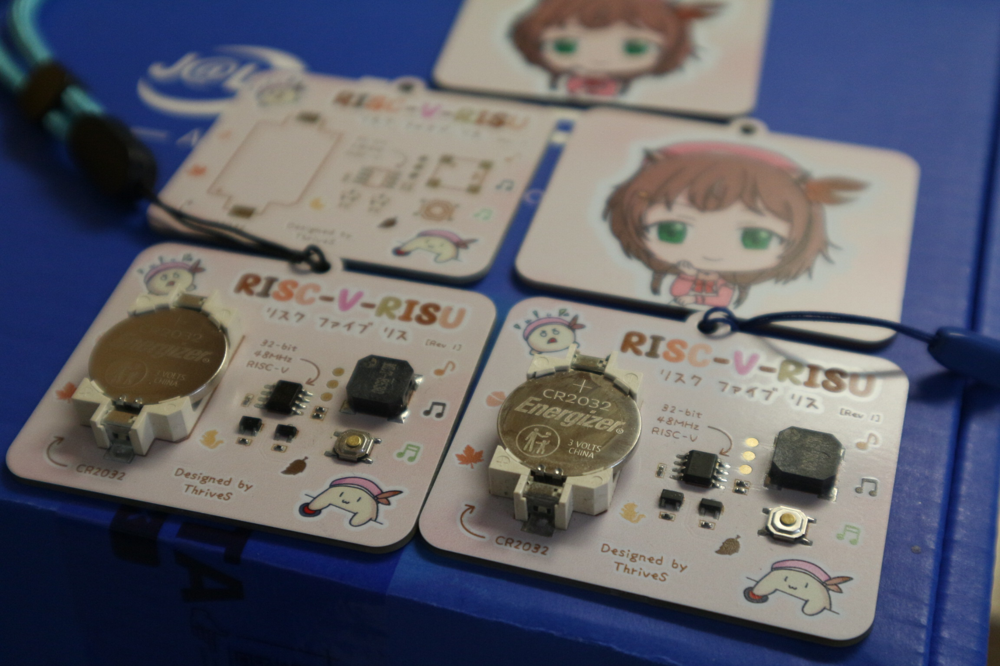

# risc-v-risu

**risc-v-risu** is a PCB keychain built around the ultra-affordable **CH32V003** microcontroller featuring the talent Ayunda Risu from Hololive ID. 

---

## Features

- **CH32V003J4M6** RISC-V MCU
- Custom **color silkscreen** (JLCPCB Multicolor Silkscreen)
- Latch circuit to save power
- Buzzer to play music

---

## Problems with [rev 1]

- The first revision uses an MLT-8530 buzzer, which draws a lot of current (even with a 47Ω resistor), resulting in a voltage drop from the CR2032 battery and causing an MCU brownout. While this problem may be temporarily solved by using LIR2032 battery, I'm considering using a piezo buzzer in the next revision.
- When the latch transistors accidentally touched, it will sometimes turns on. Replacing the pull resistors might fix it.

---

## When Ordering PCB in JLCPCB

- Set thickness to 1.6mm
- Select white solder mask
- ENIG Finish
- Make sure Multicolor Silkscreen is selected

---

## Getting Started

### Requirements

- WCH-LinkE Programmer
- WCH-LinkUtility
- PlaformIO with CH32V platform installed

### Pinout Overview

| Pin | Function     |
|-----|--------------|
| C1  | Latch        |
| C2  | Buzzer       |
| 3V3 | Power        |
| GND | Ground       |

> See the full schematic in each version folder.
